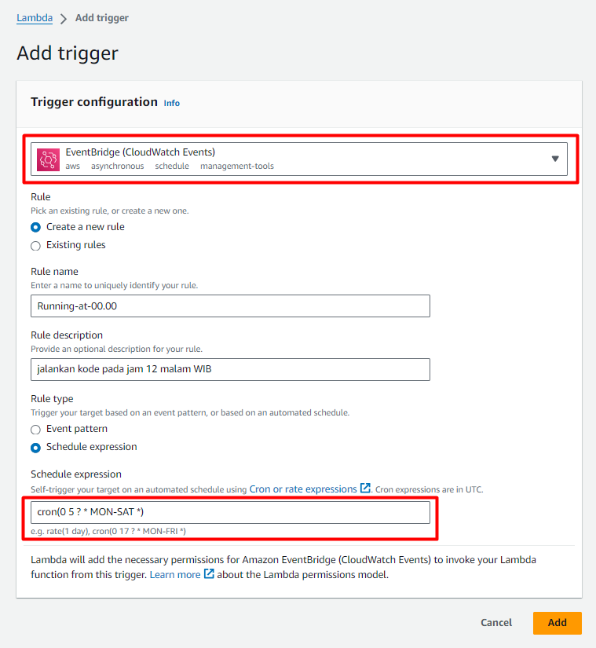

# PENGISIAN JURNAL HARIAN SIMPEG KEMENKUMHAM
Program ini dirancang untuk mengisi jurnal harian SIMPEG KEMENKUMHAM secara otomatis untuk tiga hari waktu kerja dan satu hari libur. Kegiatan yang diisi dalam jurnal harian diambil dari  [Google Spreadsheet](https://docs.google.com/spreadsheets/d/1PQPv01YzvIr9CLvSz-f53A5SAG_C2zKdq8ccfqA-6qw/edit?usp=sharing) yang dapat diedit kapan pun. Program ini menyediakan dua cara untuk dijalankan: pada komputer lokal atau dengan deployment pada AWS Lambda.


---

## Persyaratan
Sebelum menjalankan program, pastikan Anda memiliki:

1. Akses ke Google Spreadsheet yang berisi kegiatan harian.
2. Kredensial untuk mengakses Google Spreadsheet API.
3. Akun email dan kata sandi untuk mengirim email (jika diperlukan).
4. NIP dan kata sandi untuk login ke SIMPEG KEMENKUMHAM.
5. Docker (jika menjalankan pada komputer lokal).
6. Akun AWS (jika melakukan deployment pada AWS Lambda).

## Menjalankan Program pada Komputer Lokal
Terdapat dua cara menjalankan program ini

Ikuti langkah-langkah berikut untuk menjalankan program pada komputer lokal:

#### 1. Clone Repository 
clone repository ini dengan perintah
```bash
git clone https://github.com/allail-qadrillah/Pengisian-Jurnal-Harian-KEMENKUMHAM-Pegawai-senin-kamis-jumat-sabtu.git
```
#### 2. Konfigurasi [Google Spreadsheet API](https://www.youtube.com/watch?v=zCEJurLGFRk) dan [Sheet Template](https://docs.google.com/spreadsheets/d/1nZFDpksz0wP68EUuUR_FfiENzwdYnKU0HHoWhbjLlDo/edit?usp=sharing)

dapatkan konfigurasi Google Spreadsheet API dan dapatkan kredensial sebagai file `sheet_cred.json`

#### 3. Dapatkan [Email Password](https://www.youtube.com/watch?v=5YdpQF0TFpc) 
email password diperlukan untuk dapat mengirim email dengan library `smtplib`

#### 4. Set up Environment Variabel
terdapat 5 environment variabel
```
nip=NIP_SIMPEG
password=PASSWORD_SIMPEG
email_sender=EMAIL_PENGIRIM
email_password=PASSWORD_EMAIL
sheet_id=SHEET_ID
waktu_mulai = YYYY-MM-DD
waktu_selesai = YYYY-MM-DD
```
variabel waktu_mulai dan waktu_selesai dibutuhkan untuk mengkalkulasikan jadwal kerja 

isi waktu_mulai dengan tanggal Hari Kerja 1

#### 5. Build Docker
Chrome yang digunakan untuk menjalankan program secara lokal ini menggunakan Remote/Selenium Grid dari [Image Selenium/standalone-chrome](https://hub.docker.com/r/selenium/standalone-chrome). agar setiap pergantian versi Chrome tidak menimbulkan masalah kedepannya.

Pertama lakukan Pull Command Image
```bash
docker pull selenium/standalone-chrome
```
Selanjutnya jalankan Container 
```bash
docker run -d -p 4444:4444 -p 7900:7900 --shm-size="2g" selenium/standalone-chrome:latest
```
Untuk melihat apa yang terjadi pada container, akses ke  http://localhost:7900/?autoconnect=1&resize=scale&password=secret

Anda juga dapat menjalankan kontainer dengan Docker Compose

```bash
docker-compose up -d
```
Akses UI dari Selenium Grid di http://localhost:4444/ui
#### 6. RUN!
buat Virtual Environtment
```bash
python -m venv env
```
aktifkan Virtual Environtment
```bash
./venv/Scripts/Activate.ps1
```

Jalankan program dengan perintah 
```bash
python local.py
```

## Menjalankannya pada AWS Lambda (deployment)
Mendeploy program pada AWS Lambda dapat menghemat pengeluaran karena dijalankan secara server less (menggunakan resource komputer ketika diperlukan saja)dari pada mendeploynya dengan menjalankan 24/7. pada AWS Lambda kita dapat menggunakan Trigger Cronjob untuk menschedule program.

Sebelum melanjutkan step dibawah, pastikan memiliki akun AWS dan command prompt telah terkoneksi/terAutentikasi dengan AWS

#### 1. Buat Repository pada [Elastic Container](https://ap-southeast-1.console.aws.amazon.com/ecr/private-registry/)
1. klik **Create repository**
2. isi semua form yang diperlukan
3. klik **Create repository**
4. buka repository yang telah dibuat dan klik menu **View push commands**
3. ikuti setiap step yang ada

#### 2. Buat Function [AWS Lambda](https://ap-southeast-1.console.aws.amazon.com/lambda)
1. klik **Create function**
2. pilih kontainer yang telah dipush dan klik **Create function**

3. karena menggunakan selenium, kita perlu mengubah konfigurasi Timeout minimal menjadi 5 menit dan Memory minimal menjadi 512 MB.  
  
4. setup environment variabel
4. Test fungsinya

#### 3. Tambahkan Trigger
program akan dijalankan pada setiap jam 12 malam, maka gunakan EventBridge untuk melakukan hal tersebut.

schedule expressionnya adalah `cron(* 17 ? * * *)`

nilai **17** digunakan untuk menyesuaikan dengan timezone WIB, karena server memiliki timezone UTC


## Struktur Kode dan Dokumentasi

Kode sumber program ini ditulis dalam bahasa Python dan menggunakan beberapa library seperti `selenium`, `smtplib`, dan `gspread`. Dokumentasi kode tersedia dalam bentuk komentar di dalam file sumber.