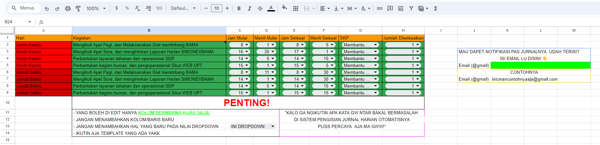

# PENGISIAN JURNAL HARIAN SIMPEG KEMENKUMHAM
Mengisi jurnal harian secara otomatis dari hari senin sampai sabtu.

Dengan format hari Senin sampai Kamis dan Jumat dengan Sabtu kegiatan yang berbeda.

Kegiatan diambil dari [Google Spreadsheet](https://docs.google.com/spreadsheets/d/1nZFDpksz0wP68EUuUR_FfiENzwdYnKU0HHoWhbjLlDo/edit?usp=sharing) sehingga dapat diedit kapanpun.


---

## Bagaimana Menjalankan programnya?
Terdapat dua cara menjalankan program ini

Pertama adalah menjalankannya pada local computer dan Kedua mendeploy pada AWS Lambda.

## 1.Menjalankannya pada Local Computer
#### 1. Clone Repository 
clone repository ini 
```bash
git clone
```
#### 2. Konfigurasi [Google Spreadsheet API](https://www.youtube.com/watch?v=zCEJurLGFRk) dan [Sheet Template](https://docs.google.com/spreadsheets/d/1nZFDpksz0wP68EUuUR_FfiENzwdYnKU0HHoWhbjLlDo/edit?usp=sharing)
lakukan konfigurasi untuk mengakases spreadsheet. 

dapatkan sheet credential dan buatkan nama file sebagai `sheet_cred.json`

#### 3. Dapatkan [Email Password](https://www.youtube.com/watch?v=5YdpQF0TFpc) 
email password diperlukan untuk dapat mengirim email dengan library `smtplib`

#### 4. Set up Environment Variabel
terdapat 5 environment variabel
```
nip=NIP_SIMPEG
password=PASSWORD_SIMPEG
email_sender=EMAIL_PENGIRIM
email_password=PASSWORD_EMAIL
sheet_id=SHEET_ID
```

#### 5. Build Docker
Chrome yang digunakan untuk menjalankan program secara lokal ini menggunakan Remote/Selenium Grid dari [Image Selenium/standalone-chrome](https://hub.docker.com/r/selenium/standalone-chrome). agar setiap pergantian versi Chrome tidak menimbulkan masalah kedepannya.

Pertama lakukan Pull Command Image
```bash
docker pull selenium/standalone-chrome
```
Selanjutnya jalankan Container 
```bash
docker run -d -p 4444:4444 -p 7900:7900 --shm-size="2g" selenium/standalone-chrome:latest
```
Untuk melihat apa yang terjadi pada container, akses ke  http://localhost:7900/?autoconnect=1&resize=scale&password=secret

#### 6. RUN!
buat Virtual Environtment
```bash
python -m venv env
```
aktifkan Virtual Environtment
```bash
./venv/Scripts/Activate.ps1
```

Jalankan program dengan perintah 
```bash
python local.py
```

## 2. Menjalankannya pada AWS Lambda (deployment)
Mendeploy program pada AWS Lambda dapat menghemat pengeluaran karena dijalankan secara server less (menggunakan resource komputer ketika diperlukan saja)dari pada mendeploynya dengan menjalankan 24/7. pada AWS Lambda kita dapat menggunakan Trigger Cronjob untuk menschedule program.

Sebelum melanjutkan step dibawah, pastikan memiliki akun AWS dan command prompt telah terkoneksi/terAutentikasi dengan AWS

#### 1. Buat Repository pada [Elastic Container](https://ap-southeast-1.console.aws.amazon.com/ecr/private-registry/)
1. klik **Create repository**
2. isi semua form yang diperlukan
3. klik **Create repository**
4. buka repository yang telah dibuat dan klik menu **View push commands**
3. ikuti setiap step yang ada

#### 2. Buat Function [AWS Lambda](https://ap-southeast-1.console.aws.amazon.com/lambda)
1. klik **Create function**
2. pilih kontainer yang telah dipush dan klik **Create function**

3. karena menggunakan selenium, kita perlu mengubah konfigurasi Timeout minimal menjadi 5 menit dan Memory minimal menjadi 512 MB.  
  
4. setup environment variabel
4. Test fungsinya

#### 3. Tambahkan Trigger


KETIKA LAMBDA SELENIUM DI TEST UNTUK YANG KEDUA DAN SETERUSNYA DAPET ERROR